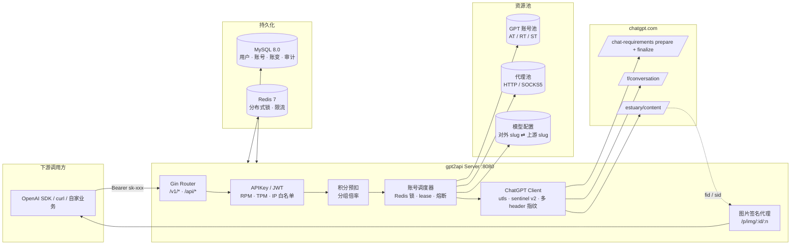

# gpt2api

> 基于逆向 **chatgpt.com** 的 OpenAI 兼容 SaaS 网关 —— 多账号池 / 代理池 / **IMG2 终稿直出** / **批量出图** / **本地 2K/4K 高清放大** / **高并发调度** / 积分计费 / 管理后台一体化。

<p align="center">
  <a href="https://github.com/432539/gpt2api/stargazers"></a>
  <a href="https://github.com/432539/gpt2api/releases"></a>
  <a href="https://golang.org/"></a>
  <a href="https://vuejs.org/"></a>
  <a href="https://github.com/432539/gpt2api/blob/main/LICENSE"></a>
</p>

- **仓库地址**:<https://github.com/432539/gpt2api>
- **技术交流 QQ 群**:`382446`(入群请注明「gpt2api」)

---

## 目录

- [一、项目定位](#一项目定位)
- [📸 界面预览](#-界面预览)
- [二、核心特性](#二核心特性)
- [三、技术栈](#三技术栈)
- [四、架构概览](#四架构概览)
- [五、快速开始(Docker 一键部署)](#五快速开始docker-一键部署)
- [五-B、Zeabur 一键部署(推荐)](#五-bzeabur-一键部署推荐)
- [六、配置说明](#六配置说明)
- [七、API 使用示例](#七api-使用示例)
- [八、重点能力详解](#八重点能力详解)
  - [8.1 IMG2 出图](#81-img2-出图)
  - [8.2 4K / 2K 高清输出(本地 Catmull-Rom 放大)](#82-4k--2k-高清输出本地-catmull-rom-放大)
  - [8.3 批量出图 / 多张聚合](#83-批量出图--多张聚合)
  - [8.4 高性能高并发调度](#84-高性能高并发调度)
- [九、管理后台功能概览](#九管理后台功能概览)
- [十、目录结构](#十目录结构)
- [十一、二次开发 / 定制](#十一二次开发--定制)
- [十二、FAQ](#十二faq)
- [十三、Roadmap](#十三roadmap)
- [十四、参与贡献](#十四参与贡献)
- [十五、免责声明与风险提示](#十五免责声明与风险提示)
- [十六、License](#十六license)

---

## 一、项目定位

`gpt2api` 是一个**自建的 ChatGPT → OpenAI 兼容网关**,把 `chatgpt.com` Plus / Team / Codex 账号的能力,以 **完全兼容 OpenAI API** 的形式(`/v1/chat/completions` / `/v1/images/generations`)开放给下游调用方,同时配套一整套 SaaS 运营后台。

适合的场景:

- 你手头有一批 ChatGPT Plus / Team / Codex 账号,想对外提供稳定的 **GPT Image / DALL·E 3 / IMG2 高清大图**服务;
- 想给公司 / 团队内部开通 OpenAI 风格的代理网关,把所有调用统计、计费、审计集中管理;
- 想低成本搭一个带积分 / 套餐 / 易支付的 AI API 中台,面向 C 端或 B 端开发者售卖。

> 本项目当前版本**聚焦图片模型**(详见 [8.1 IMG2 出图](#81-img2-出图)、[8.2 4K/2K 高清输出](#82-4k--2k-高清输出本地-catmull-rom-放大) 与 [8.3 批量出图](#83-批量出图--多张聚合))。文字通路(`/v1/chat/completions`)代码层完整保留,但因 `chatgpt.com` 新 sentinel 协议存在短期不稳定因素,UI 入口已在当前版本关闭,恢复只需改一行 feature flag,详见 [十一、二次开发](#十一二次开发--定制)。

---

## 📸 界面预览

> 截图来自 **在线体验(Playground)** 页 · `gpt-image-2` / `picture_v2`(IMG2 终稿)· `9:16` 比例 · 单次调用一张 prompt 批量出图。

### 在线体验 · 文生图 / 批量出图

<p align="center">
  
</p>

- 左侧:模型选择、画面比例(1:1 / 16:9 / **9:16**)、张数、PROMPT 输入、prompt 预设库;
- 右侧:**同一个任务聚合返回多张高清终稿**(IMG2 命中时单次 `/f/conversation` 一次性产出 2 张,再配合"张数 N"即可成批扩图);
- 点击任意一张可进入全屏放大预览 ↓。

### 管理后台 · 单图放大预览

<p align="center">
  
</p>

- 左侧:**个人中心 / 后台管理** 双分区菜单 —— API Keys、使用记录、账单与充值、在线体验、接口文档、用户管理、GPT 账号池、代理管理、模型配置、用户分组、用量统计、全局 Keys、审计日志、数据备份、系统设置,一个台子全搞定;
- 中间:全屏放大查看终稿,直接右键"图片另存为"。所有图片 URL 都是内置 `/p/img/:task/:idx` **HMAC 签名代理**,绕过 `chatgpt.com` `estuary/content` 的 403 防盗链。

---

## 二、核心特性

| 分类 | 能力 |
|------|------|
| **上游协议** | 完整逆向 `chatgpt.com` `f/conversation` 两步 sentinel(`/prepare` + `/finalize`)、PoW、`conduit_token`、全套 `oai-*` / `Sec-Ch-Ua-*` 指纹头 |
| **图片生成** | 文生图、**图生图 / 多图参考**、**IMG2 正式版直出**(速度优先,SSE 够数即返回,60s 短轮询补齐)、**本地 2K/4K PNG 高清放大**(Catmull-Rom 插值,按需触发 + 进程内 LRU)、轮询 + SSE 直出双通道 |
| **账号池** | JSON / AT / RT / ST 四种方式批量导入,**自动刷新**、**额度探测**、**风控熔断**、按账号稳定绑定 `oai-device-id` / `oai-session-id` |
| **代理池** | 支持 HTTP / SOCKS5,健康分自动探测,按账号强绑定代理,避免 IP 指纹混用 |
| **调度器** | 串行 lease + Redis 分布式锁,`min_interval_sec` 单号最小间隔、`daily_usage_ratio` 日熔断、`cooldown_429_sec` 限速退避 |
| **OpenAI 兼容** | `/v1/chat/completions`(保留)、`/v1/images/generations`、`/v1/images/edits`、`/v1/images/tasks/:id`、`/v1/models` |
| **下游 Key** | 独立于用户账号的 `sk-` Key,支持 **RPM / TPM / 日配额 / IP 白名单 / 模型白名单** |
| **计费** | 积分钱包 + 预扣结算、分组倍率(VIP / 内部 / 渠道)、充值套餐、**易支付(EPay)**接入 |
| **安全** | AES-256-GCM 加密 AT / cookies、JWT 登录、RBAC 权限、**管理员写操作全链路审计**、高危操作 `X-Admin-Confirm` 二次确认 |
| **运维** | 数据库一键备份 / 恢复(`mysqldump` + gzip)、上传单文件限额、备份保留策略 |
| **图片防盗链** | 内置签名代理 `/p/img/:task/:idx`,HMAC 签名 + 过期时间,绕过 `chatgpt.com` `estuary/content` 的 403 |
| **前端** | Vue 3 + Element Plus 单页控制台,账户池 / 代理池 / 模型 / 用户 / 积分 / 审计 / 备份 / 系统设置全覆盖 |

---

## 三、技术栈

**后端**

- Go 1.22+
- Gin(HTTP 框架) / sqlx(MySQL 访问) / Viper(配置) / Zap(日志)
- MySQL 8.0(业务数据 + 审计 + 账变) / Redis 7(分布式锁 / 限流 / 缓存)
- `refraction-networking/utls`(TLS 指纹,用于规避 `chatgpt.com` JA3 检测)
- `golang-jwt/jwt` / `golang.org/x/crypto`(鉴权 + 密码学)
- Goose(数据库迁移)

**前端**

- Vue 3 + Vite 5 + TypeScript 5
- Element Plus 2.7(组件库)
- Pinia(状态管理) / `pinia-plugin-persistedstate`
- Vue Router 4
- Axios

**部署**

- Docker Compose(MySQL + Redis + server,可选 nginx)
- **Zeabur 一键部署**(GitHub 直连,自动构建 + 自动建表)
- 默认单机;水平扩展见 [`deploy/README.md`](deploy/README.md)

---

## 四、架构概览



**数据流(一次文生图调用)**:

1. 下游 `POST /v1/images/generations` 携带 `Authorization: Bearer sk-xxx`;
2. Gateway 校验 Key → 查下游限流(RPM/TPM/日配额)→ 预扣积分;
3. Scheduler 从账号池挑一个 `idle` 且满足 `min_interval_sec` 的账号,拿 Redis 锁建立 lease;
4. 通过账号绑定的代理,走 `utls` TLS 指纹,按真实 Edge 143 浏览器的 header/payload 访问 `chatgpt.com`;
5. 两步 sentinel 换 chat-requirements token → `/f/conversation/prepare` 拿 `conduit_token` → SSE 上游生图;
6. 解析 tool message 拿 `fids` / `sids`,够 N 张立即短路下载,不够再短轮询 60s 补齐;
7. 所有图片 URL 经 HMAC 签名,返回 `https://<your-domain>/p/img/<task>/<idx>?exp=…&sig=…`;
8. 扣费结算 + 写 usage_logs + 释放 lease + 更新账号状态。

---

## 五、快速开始(Docker 一键部署)

> ⚠️ **本项目的 Dockerfile 是"宿主预编译 + 容器运行"架构**(为规避国内拉 `proxy.golang.org` / npm registry 卡死的问题)。容器内**不做** `go build` / `npm install`,完全依赖宿主机先产出二进制和前端产物。  
> 因此步骤是:**准备环境 → 克隆仓库 → 本地预编译 → docker compose build + up**。直接 `docker compose up --build` 会报 `deploy/bin/gpt2api: not found`。

### 1. 准备环境

**宿主机(打包机)需要安装**:

| 软件 | 最低版本 | 用途 |
|------|---------|------|
| **Go** | 1.22+ | 交叉编译 `gpt2api` + `goose` 二进制 |
| **Node.js** | 18+(推荐 20 LTS)| 编译前端 Vite 产物 |
| **Docker** | 24+ | 构建 + 运行镜像 |
| **docker compose** | v2 插件 | 启动 mysql / redis / server 编排 |
| **git** | 任意 | 克隆仓库 |

> Windows 用户装 Go + Node + Docker Desktop 即可;Linux 服务器一条 `apt install -y golang-go nodejs npm docker.io docker-compose-plugin` 基本够用。  
> 打包机与运行机**不必是同一台**,`build-local.sh/ps1` 默认交叉编译成 `linux/amd64`,产出拷到服务器上也能直接 `docker compose build` 起。

**运行环境需要**:

- 一个能直连 `chatgpt.com` 的 VPS,或者至少一个可用的 HTTP / SOCKS5 代理;
- 至少 1 个 ChatGPT Plus / Team / Codex 账号(能导出 AT / RT / ST 或 JSON 会话信息)。

### 2. 克隆仓库

```bash
git clone https://github.com/432539/gpt2api.git
cd gpt2api
```

### 3. 本地预编译(**必做,容器内不会帮你 build**)

这一步会产出三个东西,镜像 COPY 进去就能直接起:

| 产物 | 路径 | 由谁产出 |
|------|------|---------|
| 后端二进制(linux/amd64) | `deploy/bin/gpt2api` | `go build ./cmd/server` |
| 迁移工具(linux/amd64) | `deploy/bin/goose` | `go build github.com/pressly/goose/v3/cmd/goose@v3.20.0` |
| 前端产物 | `web/dist/` | `cd web && npm install && npm run build` |

仓库已经把**这三步打包到一个脚本**,一条命令搞定:

**Linux / macOS / WSL:**

```bash
bash deploy/build-local.sh
# 增量:只编译缺失的 goose。第一次会自动 npm install(首次慢,之后秒级)
# 强制重编译 goose:bash deploy/build-local.sh --force
```

**Windows PowerShell:**

```powershell
powershell -NoProfile -File deploy\build-local.ps1
# 强制重编译 goose:powershell -NoProfile -File deploy\build-local.ps1 -Force
```

脚本结束后应当能看到:

```text
[build-local] done. artifacts:
-rwxr-xr-x ... deploy/bin/gpt2api       ~32M
-rwxr-xr-x ... deploy/bin/goose         ~34M
-rw-r--r-- ... web/dist/index.html
```

> 改完后端代码后**只需重跑 `build-local` 再 `docker compose build server`**;改前端只跑 `npm run build` + `docker compose build server` 即可。  
> 有同事反馈 `go get` / `npm install` 慢,可以先 `go env -w GOPROXY=https://goproxy.cn,direct` 和 `npm config set registry https://registry.npmmirror.com`。

### 4. 配置 `.env` 与启动容器

```bash
cd deploy
cp .env.example .env
```

**必改** `.env` 中的三项:

```env
JWT_SECRET=请改成 >=32 位随机串
CRYPTO_AES_KEY=请改成严格 64 位 hex(32 字节 AES-256)
MYSQL_ROOT_PASSWORD=你自己的强密码
MYSQL_PASSWORD=你自己的强密码
```

生成两个随机值的快捷命令:

```bash
openssl rand -hex 32   # CRYPTO_AES_KEY(64 位 hex)
openssl rand -base64 48 | tr -d '=/+' | cut -c1-48   # JWT_SECRET
```

启动:

```bash
docker compose build server    # 首次或后端/前端代码有更新后执行
docker compose up -d
docker compose logs -f server
```

启动过程里 `server` 会自动:

1. 等 `mysql` 健康;
2. 跑 `goose up` 应用全部迁移(用户 / 账号 / 审计 / 备份元数据等十余张表);
3. 启动 HTTP 服务 `:8080`。

### 5. 首次登录

- 前端站点地址:`http://<服务器IP>:8080/`
- **本项目不内置任何默认账号密码**。采用"**首位注册者自动为 admin**"的 Bootstrap 机制(见 `internal/auth/service.go` 中的 `Register`)—— 第一次访问站点时直接打开 `http://<服务器IP>:8080/register` 完成注册,这个账号自动获得 `admin` 角色,后续注册都只是普通用户。
- 完成首位 admin 注册后,强烈建议在**管理后台 → 系统设置**里关闭"允许开放注册",避免陌生人自助注册占用资源。
- 忘记管理员密码、或需要把某个普通用户提权为 admin,见「FAQ · 管理员密码找回 / 提权」。

### 6. 日常更新流程速查

| 场景 | 命令 |
|------|------|
| **仅改了前端** | `cd web && npm run build` → `cd ../deploy && docker compose build server && docker compose up -d server` |
| **仅改了后端** | `bash deploy/build-local.sh`(前端 `npm run build` 无代价也会重跑)→ `cd deploy && docker compose build server && docker compose up -d server` |
| **拉 main 新版** | `git pull` → `bash deploy/build-local.sh` → `docker compose build server && docker compose up -d server` |
| **只重启不重建** | `docker compose restart server` |
| **想回滚上一版** | `docker compose down server` → 恢复 `deploy/bin/gpt2api` + `web/dist` 备份 → `docker compose build server && docker compose up -d server` |

### 7. 五分钟跑通第一次生图

1. **管理后台 → 代理管理** → 新建一个代理(或批量导入),确认健康分为绿色;
2. **管理后台 → GPT账号** → 批量导入 JSON / AT / RT / ST,绑定上一步的代理;
3. **管理后台 → 模型配置** → 确认有 `gpt-image-2` 等图像模型且已启用;
4. **管理后台 → 用户管理** → 给自己(或业务账号)加点积分;
5. **个人中心 → 在线体验** → 文生图 tab → 输入 prompt → 点生成;
6. 观察 `docker compose logs -f server` 里 `image runner` 系列日志,看到 `image runner result summary refs=[...] signed_count=N` 就是成功出图。

---

## 五-B、Zeabur 一键部署(推荐)

> 无需本地安装 Go / Node / Docker,GitHub 仓库直连即可全自动构建 + 上线。  
> 数据库自动建表——服务启动时内嵌 goose 迁移自动执行,**零手动 SQL**。

### 1. 前置条件

- 一个 [Zeabur](https://zeabur.com) 账号(免费额度够起步)
- 本仓库 fork 到你自己的 GitHub(或使用原仓库)

### 2. 部署步骤

1. **创建项目**:登录 Zeabur → New Project → 选区域(推荐 `ap-east` 香港)。

2. **添加 MySQL**:点 `+ Add Service` → `Marketplace` → `MySQL`。  
   Zeabur 会自动注入 `MYSQL_HOST`, `MYSQL_PORT`, `MYSQL_USERNAME`, `MYSQL_PASSWORD`, `MYSQL_DATABASE` 环境变量。

3. **添加 Redis**:点 `+ Add Service` → `Marketplace` → `Redis`。  
   Zeabur 会自动注入 `REDIS_HOST`, `REDIS_PORT`, `REDIS_PASSWORD`。

4. **部署 gpt2api**:点 `+ Add Service` → `Git` → 选择你 fork 的 `gpt2api` 仓库。  
   Zeabur 自动检测根目录 `Dockerfile`,开始多阶段构建(Go 后端 + Node 前端)。

5. **配置环境变量**:在 gpt2api 服务的 `Variables` 页面添加:

   | 变量名 | 必填 | 说明 |
   |--------|------|------|
   | `GPT2API_JWT_SECRET` | ✅ | JWT 签名密钥,至少 32 字符随机串 |
   | `GPT2API_CRYPTO_AES_KEY` | ✅ | AES-256 密钥,64 位 hex(32 字节) |
   | `GPT2API_APP_BASE_URL` | 推荐 | 对外访问 URL,如 `https://xxx.zeabur.app` |
   | `GPT2API_SECURITY_CORS_ORIGINS` | 可选 | CORS 白名单,逗号分隔 |

   > **MySQL / Redis 连接无需手动配置**——应用启动时会自动从 Zeabur 注入的 `MYSQL_*` / `REDIS_*` 环境变量组装 DSN。

6. **绑定域名**:在 `Networking` 页面添加自定义域名或使用 `*.zeabur.app` 子域。

7. **等待构建完成**:首次构建约 2~4 分钟(拉依赖 + 编译),之后每次 `git push` 自动触发重新部署。

### 3. 自动建表原理

应用启动时执行以下流程:
1. 连接 MySQL(DSN 由 Zeabur 环境变量自动组装)
2. 内嵌的 goose 迁移引擎自动执行 `sql/migrations/` 下的全部 `.sql`(幂等)
3. 首次部署自动创建全部 20+ 张表 + 种子数据
4. 后续 `git push` 新增迁移文件时,重启自动增量执行

### 4. 自动建表覆盖的关键表

| 表 | 作用 |
|---|---|
| `users` / `user_groups` | 用户体系 |
| `api_keys` | 下游 API Key |
| `oai_accounts` / `oai_account_cookies` / `account_proxy_bindings` | ChatGPT 账号池 |
| `proxies` | 代理池 |
| `models` / `billing_ratios` | 模型配置 + 分组倍率 |
| `image_tasks` | 异步生图任务 |
| `usage_logs` / `credit_transactions` | 用量 + 积分流水 |
| `recharge_orders` / `redeem_codes` | 充值 + 兑换码 |
| `system_configs` / `audit_logs` / `announcements` | 系统设置 + 审计 + 公告 |

### 5. 环境变量完整参考

所有 `configs/config.yaml` 中的配置项均可通过 `GPT2API_` 前缀的环境变量覆盖(下划线替代 `.`):

```
GPT2API_APP_LISTEN=:8080
GPT2API_MYSQL_DSN=user:pass@tcp(host:3306)/db?parseTime=true&...
GPT2API_REDIS_ADDR=host:6379
GPT2API_REDIS_PASSWORD=xxx
GPT2API_JWT_SECRET=your_secret
GPT2API_CRYPTO_AES_KEY=64_hex_chars
GPT2API_LOG_LEVEL=info
GPT2API_LOG_FORMAT=json
```

> 在 Zeabur 上,`GPT2API_MYSQL_DSN` 和 `GPT2API_REDIS_ADDR` **不需要手动设置**,应用会自动从平台注入的变量组装。

---

## 六、配置说明

**核心配置文件:`configs/config.yaml`**(Docker 部署时通过环境变量 `GPT2API_*` 覆盖;Zeabur 部署时无需此文件,全走环境变量)。完整字段见 [`configs/config.example.yaml`](configs/config.example.yaml)。

| 段落 | 关键字段 | 说明 |
|------|---------|------|
| `app` | `listen`, `base_url` | HTTP 监听地址 / 对外 base URL(签名图片代理用) |
| `mysql` | `dsn`, `max_open_conns` | MySQL 连接,生产推荐 500 + |
| `redis` | `addr`, `pool_size` | Redis,生产推荐 pool=500(锁 / 限流 / 令牌桶) |
| `jwt` | `secret`, `*_ttl_sec` | **生产必须覆盖** `secret` |
| `crypto` | `aes_key` | **生产必须覆盖**,32 字节 hex,用于加密账号 AT / cookies |
| `scheduler` | `min_interval_sec` | **单账号最小间隔秒**,对抗风控核心参数 |
| `scheduler` | `daily_usage_ratio` | 单号日消耗熔断阈值(0~1,0.6 = 消耗超过日额度 60% 自动下线) |
| `scheduler` | `cooldown_429_sec` | 连续 429 冷却时间 |
| `upstream` | `request_timeout_sec` | 上游 chatgpt.com 请求超时(图片建议 60+) |
| `upstream` | `sse_read_timeout_sec` | SSE 读超时,批量出图场景建议 300+ |
| `epay` | `gateway_url`, `pid`, `key` | 易支付网关,用于积分充值 |

**环境变量覆盖规则**:任何 `configs/config.yaml` 字段都可以用 `GPT2API_XXX_YYY` 覆盖。例如 `app.listen` → `GPT2API_APP_LISTEN`。

---

## 七、API 使用示例

> 所有 API 完全兼容 OpenAI 官方 SDK,把 `base_url` 换成你的部署地址即可。

### 7.1 生图(同步,单张)

```bash
curl https://your-domain.com/v1/images/generations \
  -H "Authorization: Bearer sk-xxx" \
  -H "Content-Type: application/json" \
  -d '{
    "model": "gpt-image-2",
    "prompt": "a cute orange cat playing with yarn, studio ghibli style",
    "n": 1,
    "size": "1024x1024"
  }'
```

**返回**(已经是 HMAC 签名的图片代理地址,可直接 `` 嵌入):

```json
{
  "created": 1776582860,
  "data": [
    {
      "url": "https://your-domain.com/p/img/img_2631ffad.../0?exp=...&sig=..."
    }
  ]
}
```

**可选:本地 2K / 4K 高清放大** —— 在 body 里加 `"upscale": "2k"` 或 `"upscale": "4k"`,后端会在图片代理 URL 首次被请求时对原图做 Catmull-Rom 插值放大并以 PNG 返回(长边 2560 / 3840 等比缩)。算法本地执行,不调用任何外部服务;首次 ~0.5~1.5s,之后进程内 LRU 毫秒级命中。**请注意这是传统插值算法,不是 AI 超分**,不会补出新纹理。详见 [8.2 4K / 2K 高清输出](#82-4k--2k-高清输出本地-catmull-rom-放大)。

### 7.2 图生图 / 多图参考(项目扩展字段)

```bash
curl https://your-domain.com/v1/images/generations \
  -H "Authorization: Bearer sk-xxx" \
  -H "Content-Type: application/json" \
  -d '{
    "model": "gpt-image-2",
    "prompt": "将这两张图合成为赛博朋克风格的海报",
    "n": 2,
    "size": "1792x1024",
    "reference_images": [
      "https://example.com/ref1.jpg",
      "data:image/png;base64,iVBORw0KG..."
    ]
  }'
```

### 7.3 Python(OpenAI SDK)

```python
from openai import OpenAI

client = OpenAI(
    base_url="https://your-domain.com/v1",
    api_key="sk-xxx",
)

resp = client.images.generate(
    model="gpt-image-2",
    prompt="cyberpunk alley in the rain, cinematic lighting",
    n=2,
    size="1792x1024",
)
for img in resp.data:
    print(img.url)
```

### 7.4 异步(适合慢 prompt / 批量场景)

```bash
# 提交任务
curl -X POST https://your-domain.com/v1/images/generations \
  -H "Authorization: Bearer sk-xxx" \
  -H "Content-Type: application/json" \
  -d '{"model":"gpt-image-2","prompt":"...", "async":true}'
# 返回 {"task_id":"img_xxx","status":"queued"}

# 轮询结果
curl https://your-domain.com/v1/images/tasks/img_xxx \
  -H "Authorization: Bearer sk-xxx"
```

---

## 八、重点能力详解

### 8.1 IMG2 出图

`chatgpt.com` 的 **IMG2 管线已正式上线**:Plus / Team 账号单次调用可返回 1~2 张高清图,体感就是**出图更快、画质更好**。`gpt2api` 的生图链路已全面对齐正式版协议,不再做"灰度命中判定 / preview_only 重试"这类节流:

- **速度优先**:SSE 里出现 `file-service` / `sediment` 引用立即下载,**不等齐 N 张**;
- **单轮单账号**:一次 `f/conversation` 最多短轮询 60 秒补齐,超时仍有 ≥ 1 张也按成功返回;
- **硬错误才切账号**:只有 `rate_limited` / `no_available_account` / `auth_required` 才会触发一次跨账号重试,其他错误直接暴露给调用方便于排障。

#### 如何判断本次成功出图?

`gpt2api` 在图片生成的每一个关键节点都打了结构化日志,观察 `docker compose logs -f server` 中的 `image runner` 系列:

```text
image runner SSE parsed                  sse_fids=[file_xxx,file_yyy] finish_type=stop image_gen_task_id=...
image runner enough refs from SSE, skip polling   # SSE 阶段已够数,0 次轮询
image runner poll done                   poll_status=success poll_fids=[file_xxx]
image runner result summary              refs=[...] signed_count=2
```

如果 Poll 超时(60s 内没拿到任何图),会直接落到 `poll_timeout`,不再悄悄换账号重试。

#### 数据库里复盘

每张图片都会被持久化到 `image_tasks` 表,带上 `account_id` / `status` / `image_urls`:

```sql
SELECT
  account_id,
  COUNT(*)                                AS total,
  SUM(status = 'success')                 AS success,
  ROUND(SUM(status = 'success') * 100 / COUNT(*), 2) AS success_rate_pct,
  ROUND(AVG(JSON_LENGTH(image_urls)), 2)  AS avg_imgs_per_task
FROM image_tasks
WHERE created_at > NOW() - INTERVAL 1 DAY
GROUP BY account_id
ORDER BY success_rate_pct DESC;
```

### 8.2 4K / 2K 高清输出(本地 Catmull-Rom 放大)

`chatgpt.com` 原生只提供 `1024×1024` / `1792×1024` / `1024×1792` 三档原图。面板 / API 都支持一个扩展字段 `upscale`,在**拿到原图后**由网关在本地把画面放大到 2K / 4K 后以 PNG 返回。

#### 档位与尺寸

| `upscale` | 长边 | 举例(原 1024×1024) | 举例(原 1792×1024) |
|-----------|------|---------------------|---------------------|
| `""`(默认) | 原图 | 1024×1024 | 1792×1024 |
| `"2k"` | 2560 | 2560×2560 | 2560×1463 |
| `"4k"` | 3840 | 3840×3840 | 3840×2194 |

短边按原比例等比缩,不做裁切;**若原图长边已经 ≥ 目标,直接透传原字节**(避免重复有损编码)。

#### 工作原理

1. 生图时 `upscale` 只写进 `image_tasks.upscale`,**不改变**与上游 `chatgpt.com` 的交互,也不影响生图速度;
2. 图片代理 URL `/p/img/:task_id/:idx` 被请求时,后端按 `task.upscale` 决定是否放大:
   - 查进程内 **LRU 缓存**(默认 512MB,约 50 张 4K PNG);
   - 未命中 → 拉原图 → `image.Decode` → `golang.org/x/image/draw.CatmullRom` → `png.Encode`(BestSpeed) → 写入 LRU;
   - 命中 → 毫秒级直接返回字节。
3. 放大计算有**并发信号量**限制(默认 `NumCPU`),避免 4K 请求风暴把 CPU 打满影响主生图链路;
4. 放大失败自动**回落到原图**,不给用户白屏。

响应头 `X-Upscale` 便于排障:

```text
X-Upscale: 4k;cache=miss   # 首次放大
X-Upscale: 4k;cache=hit    # 命中缓存
X-Upscale: 4k;noop         # 原图长边已足够大,未重新编码
X-Upscale: 4k;err          # 放大失败,已回落到原图
```

#### API 调用

```bash
curl https://your-domain.com/v1/images/generations \
  -H "Authorization: Bearer sk-xxx" \
  -H "Content-Type: application/json" \
  -d '{
    "model": "gpt-image-2",
    "prompt": "a futuristic city at dusk, cinematic light",
    "n": 1,
    "size": "1792x1024",
    "upscale": "4k"
  }'
```

`/v1/images/edits`(multipart/form-data)同样支持 `upscale` 字段。

#### 面板操作

**个人中心 → 在线体验 → 文生图 / 图生图**,左侧表单新增「**输出尺寸**」单选:原图 / 2K 高清 / 4K 高清,默认原图。切换后重新生成的图代理 URL 会自动走对应放大档位。

#### 取舍与注意事项

- **不是 AI 超分**:Catmull-Rom 是传统双三次插值,只会把画面变"更大、更平滑",不会补出新的毛发、纹理、细节。对"原图本身细节不足"的画面,4K 的视觉收益有限;
- **4K 文件较大**:单张 4K PNG 通常 5~15MB。首屏仅加载 1~2 张没问题,大批量下载请考虑改调 `"2k"` 或直接用原图;
- **原图 1792 → 4K 仅 2.14x**;而方形 1024 → 4K 是 3.75x,**方形档位的视觉"放大感"最强**,效果差异也最明显;
- 若需要真正的"补细节"效果,请接入 Real-ESRGAN / SwinIR 等 AI 超分模型,那是另一个工程量级(需要模型权重 + GPU / ONNX Runtime),不在当前项目范围。

### 8.3 批量出图 / 多张聚合

`gpt2api` 支持三种"批量"场景:

| 场景 | 调用方式 | 实际并发 |
|------|---------|---------|
| **单请求 N 张** | `{"n": 4}` | 1 个账号跑 1 个会话,**IMG2 命中时会把 2 张放到同一 tool message,框架自动聚合到 `image_urls`** |
| **多请求并发** | SDK 线程池同时发 K 个请求 | K 个账号 lease 并行,受限于账号池数 × `min_interval_sec` |
| **纯异步任务池** | `{"async": true}` 提交 + 轮询 | 后端 Worker 池消费,适合 1000+ 条 prompt 的大批量场景 |

**单请求多张(`n`)**:IMG2 终稿通道下,`n=2` 通常一次就到位;`n>2` 会被框架拆成多轮 follow-up 请求在**同一会话**里完成,共享一个 account lease,避免占用多个账号。

**多请求并发(脚本示例)**:

```python
import concurrent.futures
from openai import OpenAI

client = OpenAI(base_url="https://your-domain.com/v1", api_key="sk-xxx")

prompts = ["..." for _ in range(100)]   # 100 条 prompt

def one(p):
    return client.images.generate(model="gpt-image-2", prompt=p, n=1, size="1024x1024")

with concurrent.futures.ThreadPoolExecutor(max_workers=32) as ex:
    for r in ex.map(one, prompts):
        print(r.data[0].url)
```

**账号池够大时,脚本端只需控制 `max_workers`,后端会自动按 `min_interval_sec` 给每个账号排队**,不会因为并发撞风控。

### 8.4 高性能高并发调度

#### 并发目标

| 场景 | 典型配置 | 能力 |
|------|---------|------|
| 图片生成(IMG2,账号池 100+) | `min_interval_sec=60` | **单机 >= 1000 并发图**(受账号池规模线性缩放) |
| 文字 SSE(沉睡中,见第一节) | `min_interval_sec=30` | 单机 >= 2000 并发 SSE |
| 下游 RPM/TPM 限流 | Redis 令牌桶 | 单 Key 5000 RPM 无压力 |

#### 调度核心参数(`configs/config.yaml → scheduler`)

```yaml
scheduler:
  min_interval_sec: 60          # 单账号最小间隔秒(对抗同号高频 → 429)
  daily_usage_ratio: 0.6        # 单号日配额消耗超过 60% 自动熔断下线
  lock_ttl_sec: 1200            # Redis 账号锁 TTL,lease 超时自动释放
  cooldown_429_sec: 600         # 连续 429 时该账号冷却时间
  warned_pause_hours: 24        # 收到"警告页"后的账号强制停用时长
```

#### 为什么能稳住高并发?

1. **串行 lease + Redis 锁**:每个账号同一时刻只有 1 个请求在飞,`min_interval_sec` 保证两次请求之间的最小间隔,风控曲线平滑;
2. **代理强绑定**:每个账号锁死一个代理,IP 指纹不混用,触发风控的只是个别账号,其它账号不受牵连;
3. **熔断自恢复**:账号消耗到阈值 / 收到 429 / 拿到警告页,自动进入冷却,冷却结束自动复活,无需人工干预;
4. **横向扩展**:`docker compose up --scale server=3` 即可多副本;Redis 锁天然跨节点,MySQL + backups 卷共享即可;
5. **观测友好**:`usage_logs` + `image_tasks` 两张表足以做任意维度(账号 / 用户 / 模型 / 时段)的下钻分析;后台「用量统计」已内置可视化。

#### 压测建议

- 用 `vegeta` / `wrk2` 对 `/v1/images/generations` 做恒定 QPS 压测,观察 `usage_logs.status` 分布;
- 对比调节 `min_interval_sec` 在 `30 / 60 / 90` 的成功率曲线,每批至少 500 样本;
- Redis `pool_size` 和 MySQL `max_open_conns` 生产都推荐至少 500,否则会成为瓶颈。

---

## 九、管理后台功能概览

| 页面 | 路径 | 核心能力 |
|------|------|---------|
| 个人总览 | `/personal/dashboard` | 积分余额、14 天请求趋势、热门模型、最近请求/账变 |
| 在线体验 | `/personal/play` | 浏览器内 Playground,文生图 / 图生图,实时扣费 |
| 接口文档 | `/personal/docs` | curl / Python SDK 代码片段、历史任务列表 |
| API Keys | `/personal/keys` | 创建 / 禁用 / 限流 Key |
| 使用记录 | `/personal/usage` | 本人的请求日志 / 积分流水 |
| 账单与充值 | `/personal/billing` | 套餐购买、易支付下单 |
| 用户管理 | `/admin/users` | 用户 CRUD、角色、状态、分组 |
| 积分管理 | `/admin/credits` | 手动调账、账变流水 |
| 充值订单 | `/admin/recharges` | 充值流水、套餐管理 |
| GPT 账号池 | `/admin/accounts` | JSON / AT / RT / ST 批量导入、刷新、探测、熔断 |
| 代理管理 | `/admin/proxies` | HTTP / SOCKS5、健康分探测 |
| 模型配置 | `/admin/models` | 对外 slug → 上游 slug 映射、每张图 / 每 1M token 计费 |
| 用户分组 | `/admin/groups` | 分组倍率(VIP / 内部 / 渠道) |
| 全局 Keys | `/admin/keys` | 跨用户管控所有下游 Key |
| 用量统计 | `/admin/usage` | 全站成功率 / Token / 积分收入 |
| 审计日志 | `/admin/audit` | 管理员所有写操作自动落审计 |
| 数据备份 | `/admin/backup` | `mysqldump` 一键备份 / 恢复 |
| 系统设置 | `/admin/settings` | 站点名 / 邮件 / 易支付 / 网关调度参数 |

---

## 十、目录结构

```text
gpt2api/
├── cmd/server/                 # 主入口
├── configs/                    # 配置示例
├── deploy/                     # Docker / compose / entrypoint / nginx
├── docs/                       # 补充文档
├── internal/                   # 后端核心(所有业务代码,Go 风格私有包)
│   ├── account/                  # 账号池:导入 / 刷新 / 探测 / DAO
│   ├── apikey/                   # 下游 Key
│   ├── audit/                    # 审计日志中间件
│   ├── auth/                     # 登录 / JWT
│   ├── backup/                   # 数据库备份 / 恢复
│   ├── billing/                  # 积分预扣 / 结算
│   ├── gateway/                  # OpenAI 兼容入口(chat / images / images_proxy)
│   ├── image/                    # 图片任务 Runner / 异步任务 / DAO
│   ├── middleware/               # CORS / JWT / Recover / RequestID / RateLimit
│   ├── model/                    # 模型配置(slug 映射 + 价格)
│   ├── proxy/                    # 代理池 + 健康分探测
│   ├── ratelimit/                # Redis 令牌桶
│   ├── rbac/                     # 权限常量
│   ├── recharge/                 # 充值 / 套餐 / EPay 对接
│   ├── scheduler/                # 账号调度器(核心)
│   ├── server/                   # Router 装配
│   ├── settings/                 # 动态系统设置
│   ├── upstream/chatgpt/         # ChatGPT 逆向客户端(sentinel / fchat / image / pow / headers)
│   ├── usage/                    # 请求日志 / 统计
│   └── user/                     # 用户模块
├── pkg/                        # 可被外部复用的纯工具包
├── sql/migrations/             # Goose 迁移
├── web/                        # 前端 Vue 3 源码
│   ├── src/
│   │   ├── api/                  # axios 封装
│   │   ├── config/               # feature flag(含 ENABLE_CHAT_MODEL)
│   │   ├── stores/               # pinia
│   │   ├── views/personal/       # 用户侧页面
│   │   ├── views/admin/          # 管理员页面
│   │   └── router/
│   └── dist/                     # 构建产物(Dockerfile 会 COPY 进镜像)
├── API_NOTES.md                # chatgpt.com 逆向接口备忘
├── RISK_AND_SAAS.md            # 风控 / 防封号原则
└── README.md                   # 当前文档
```

---

## 十一、二次开发 / 定制

### 后端

```bash
# 本机拉依赖
go mod tidy
# 跑迁移(先启 MySQL)
make migrate-up
# 本地热跑
make run
```

加一个新的后端接口:

1. `internal/xxx/handler.go` 加方法;
2. `internal/server/router.go` 注册路由;
3. 如果是写操作,配合 `audit.Middleware` 自动写审计。

### 前端

```bash
cd web
npm install
npm run dev          # http://localhost:5173,自动代理到 :8080
npm run build        # 构建到 web/dist/,供后端 SPA 路由挂载
```

**恢复文字模型 UI**(当前版本默认关闭):

```ts
// web/src/config/feature.ts
export const ENABLE_CHAT_MODEL = true    // ← 改这里,重新 build
```

所有涉及文字入口的页面(在线体验 / 接口文档 / 用量统计 / 模型配置 …)会自动重新出现。

### 自定义模型 slug 映射

chatgpt.com 的实际上游 slug 会随账号等级微调(例如 Plus 用 `gpt-5-3`,免费用 `gpt-5`),映射表集中在 `internal/gateway/chat.go` 的 `mapUpstreamModelSlug`。图片模型的映射在 `admin/Models.vue` 的「模型配置」页面里可视化编辑。

---

## 十二、FAQ

<details>
<summary><b>Q1. 为什么要强制绑定代理?</b></summary>

`chatgpt.com` 对 IP × 账号 × TLS 指纹 × 设备指纹做联合风控。同一个出口 IP 跑多个账号,会被识别为同一批"多开"用户,整批被封。每个账号锁死一个代理是目前最稳的防封号方案。
</details>

<details>
<summary><b>Q2. 出图偶尔 poll_timeout 怎么办?</b></summary>

IMG2 正式上线后,`gpt2api` 默认 SSE 解析完成后最多短轮询 60 秒补齐图片。如果依然没拿到任何 `file-service` / `sediment` 引用,会直接抛 `poll_timeout` 给调用方,**不会再悄悄换账号重试**(那样只会吞掉用户时间)。常见处理:

1. 在「管理后台 → GPT账号」对该账号做「全部探测」,确认代理 / 账号本身可用;
2. 把长期 `poll_timeout` 的账号绑定到更快的代理,或移出主力池;
3. 如果想在网关层面做"失败切账号"的托底重试,自行在客户端实现即可——这符合"出错就让上层看到"的设计原则。
</details>

<details>
<summary><b>Q3. 文字模型为什么默认关闭?</b></summary>

`chatgpt.com` 新 sentinel(`/prepare` + `/finalize`)对文字通路引入了 Turnstile 挑战,项目已实现完整的两步 sentinel + conduit token + 全套 header 指纹,但 Turnstile 本身需要外部 solver 才能稳定返回 `turnstile` 字段。当前版本默认走**单步回退**,适合图片(图片通路容忍度高),对文字则存在静默拒绝。接入 Turnstile solver 后把 `ENABLE_CHAT_MODEL` 改回 `true` 即可恢复。
</details>

<details>
<summary><b>Q4. 部署后图片 403 / 图片刷不出来?</b></summary>

`chatgpt.com` 的 `estuary/content` 图片 CDN 有防盗链。本项目已内置带 HMAC 签名的图片代理(`/p/img/...`),所有返回给下游的 `image_urls` 都已经是**代理后的签名 URL**。如果你仍然拿到了 `chatgpt.com` 原始 URL,说明是老版本,拉取 main 分支重建即可。
</details>

<details>
<summary><b>Q5. MySQL / Redis 能用公有云托管吗?</b></summary>

可以。修改 `.env` / `configs/config.yaml` 的 DSN 与 `redis.addr` 即可。Redis 建议至少 Redis 7,且开启 AOF;MySQL 建议 8.0+,`max_connections >= 500`。
</details>

<details>
<summary><b>Q6. 如何横向扩展到多节点?</b></summary>

`docker compose up -d --scale server=3` + 前面挂 Nginx / Traefik 做 L7。Redis 分布式锁天然支持多副本;MySQL 和 JWT / AES 密钥统一即可;`backups` 卷改成共享存储(NFS / S3 fuse)。详见 [`deploy/README.md`](deploy/README.md#单节点-vs-多节点)。
</details>

<details>
<summary><b>Q7. 支持 ChatGPT Codex / GPT-5 / Claude / Gemini 吗?</b></summary>

当前聚焦 `chatgpt.com` 逆向(涵盖 GPT-5 / GPT-5-3 / gpt-image-2 / Codex 等)。Claude / Gemini 需要接入各自原生 API 或其对应的逆向客户端,不在当前仓库范围内。
</details>

<details>
<summary><b>Q8. 管理员密码找回 / 把某个普通用户提权为 admin?</b></summary>

本项目没有内置默认 admin 账号(见「5. 首次登录」的 Bootstrap 说明),忘记密码时有两种救急手段:

**① 提权已有用户为 admin**(前提:你记得该账号的密码)

```bash
# 替换成你的 MySQL 容器名 / 用户名 / 密码 / 目标邮箱
docker exec -e MYSQL_PWD='<your_mysql_password>' gpt2api-mysql \
  mysql -ugpt2api gpt2api \
  -e "UPDATE users SET role='admin' WHERE email='you@example.com';"
```

**② 重置某个用户的密码为已知明文**

项目用 `golang.org/x/crypto/bcrypt`(cost=10)保存密码哈希,重置流程:

```bash
# 1) 在任意一台装了 Go 的机器上,用下面这段一次性小脚本把明文转成 bcrypt hash
cd /tmp && mkdir bcgen && cd bcgen && go mod init bcgen \
  && go get golang.org/x/crypto/bcrypt
cat > main.go <<'EOF'
package main
import ("fmt"; "os"; "golang.org/x/crypto/bcrypt")
func main() {
  h, _ := bcrypt.GenerateFromPassword([]byte(os.Args[1]), 10)
  fmt.Println(string(h))
}
EOF
go run . 'MyNewPassword@123'
# 输出例如:$2a$10$ljpcvSGUybg8vN4Bd3zjBu1YlQipf/gkeWMOflGUvw7EoTfM4/t.i

# 2) 把这个 hash 写进 users.password_hash(整行原样粘贴,带 $2a$...)
docker exec -e MYSQL_PWD='<your_mysql_password>' gpt2api-mysql \
  mysql -ugpt2api gpt2api -e "UPDATE users \
    SET password_hash='\$2a\$10\$ljpcvSGUybg8vN4Bd3zjBu1YlQipf/gkeWMOflGUvw7EoTfM4/t.i' \
    WHERE email='you@example.com';"

# 3) 用新密码 MyNewPassword@123 登录即可。
```

bcrypt 同明文每次生成的 hash 不同都能互相校验,上面的 hash 字符串**只能对应明文 `MyNewPassword@123`**,换明文必须重跑 Step 1。
</details>

<details>
<summary><b>Q9. 4K 出图看着像"糊了放大",没有更多细节?</b></summary>

这是预期行为。`gpt2api` 的 4K / 2K 是**本地 Catmull-Rom 插值放大**,属于传统算法:只会让图像尺寸变大、边缘更平滑,**不会像 AI 超分那样补出新的纹理 / 毛发 / 发丝细节**。适合的场景:

- 打印 / 海报 / 大屏展示,需要物理像素够大;
- 原图已经细节充分(例如 `1792×1024` 的复杂场景),仅仅是想铺满 4K 显示器;
- 不想引入额外的 GPU / 超分模型推理成本。

如果你确实需要"补细节",请自行接入 Real-ESRGAN / SwinIR / GFPGAN 等 AI 超分模型(通常需要 GPU 或 ONNX Runtime),或等待后续 Roadmap 里的 M14。详细原理见 [8.2 4K / 2K 高清输出](#82-4k--2k-高清输出本地-catmull-rom-放大)。
</details>

---

## 十三、Roadmap

- [x] M1 骨架:配置 / 迁移 / 鉴权 / RBAC
- [x] M2 账号池 + 调度器
- [x] M3 生图 runner + IMG2 支持
- [x] M4 下游 Key 全特性(RPM/TPM/IP/模型白名单)
- [x] M5 积分钱包 + 易支付充值
- [x] M6 管理后台(Vue 3)
- [x] M7 风控熔断 + 图片签名代理
- [x] M8 IMG2 终稿直出 + 多图聚合
- [x] M9 本地 2K/4K 高清放大(Catmull-Rom + LRU 缓存)
- [ ] M10 Turnstile solver 接入 → 恢复文字通路
- [ ] M11 图片任务大批量 Worker 池
- [ ] M12 账号分组(按出图成功率 / 地区分配)
- [ ] M13 Prometheus 指标 + Grafana 大盘
- [ ] M14 对接 Real-ESRGAN 等 AI 超分作为 4K 放大的可选后端

---

## 十四、参与贡献

欢迎 PR / Issue。提交前请:

1. `go vet ./... && go test ./...` 全绿;
2. `cd web && npm run build` 能通过;
3. Commit 用中文或英文均可,但请**明确写清楚动机**(是 fix 还是 feature,涉及哪个模块);
4. 涉及上游协议改动的 PR,请在 PR 描述里附上 HAR / curl 证据,不凭感觉改指纹。

**代码规范**:

- Go:标准 `gofmt`,包名小写;业务代码放 `internal/`,纯工具放 `pkg/`;
- Vue / TS:`vue-tsc --noEmit` 必须通过;文件名 PascalCase,组件 `<script setup lang="ts">`。

---

## 十五、免责声明与风险提示

> 本项目仅用于**技术学习与研究**。使用者应自行承担以下风险并遵守当地法律法规:

1. **账号封禁风险**:逆向 `chatgpt.com` 违反 OpenAI ToS,账号可能被限制 / 封禁,项目不对任何账号损失负责;
2. **法律合规风险**:在某些司法辖区绕过服务商地理限制 / 二次售卖 API 服务可能触犯相关法律,请使用者自行评估;
3. **上游变更风险**:chatgpt.com 协议随时可能调整,本项目无法保证 100% 可用,遇到问题请及时升级或通过 QQ 群反馈;
4. **数据安全**:生产环境务必修改默认密钥、开启 HTTPS、定期备份、限制后台 IP 访问;
5. **禁止用途**:禁止用于生成违法、暴力、色情、未成年人相关内容或以此从事诈骗 / 欺诈活动。

作者不保证项目适合任何特定用途,也不对任何直接或间接损失负责。**使用即视为同意本免责条款。**

---

## 十六、License

[MIT](LICENSE) © 2026 gpt2api contributors.

---

## 技术交流

- **QQ 群**:`382446`(入群请注明「gpt2api」/「github」)
- **Issue**:<https://github.com/432539/gpt2api/issues>
- **Discussions**:<https://github.com/432539/gpt2api/discussions>

如果这个项目对你有帮助,请给个 ⭐ Star;二次开发或商用遇到问题,欢迎进群交流。
